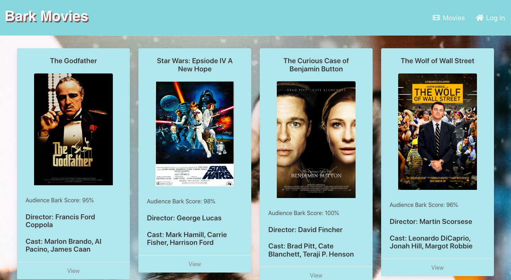

# Project2_team10
Project #2 - Maddy Doggy 🐶

## The Challenge 🔐
Our users want to creat an application include node.js, handlebars and MVC to create a full-stack application. Our application must use MVC and handlebars. 




## The Concept 🔑
We want to create a site that show the list of different movies and their rating base on bark score and user can log in to leave a review for their movie. We are using Bulma to use as a CSS Bootstrap for this application. 

## User Story 📃

```
AS a user,
I WANT to have a movie review website,
SO THAT I can choose a movie to watch and review it after
```

## The Logic 🔍

```
GIVEN a amateur movie review website,
WHEN I visit the site for the first time
THEN   I   am   presented   with   the   homepage,   which   includes   some   movies,   ranking,
trending; navigation links for the Movies and the option to log in
WHEN I click on the login option
THEN I am taken to the login page
WHEN I choose to create an account instead
THEN I am redirected to the sign up page and prompted to enter my username and
password
WHEN I am signed in to the site
THEN I am taken back to the homepage, where the navigation shows Movies and the
option to log out
WHEN I click on the movie option
THEN I am taken to the all movies page, where I can see the title and bark score of
every movie
WHEN I click a movie title
THEN I am taken to the movie page (movie.handlebars) of that specific movie, where
I can see the title, director, cast, barkscore, a button to add new movie (if logged in)
and the comment of this movie
WHEN I click the add movie button
THEN I am taken to the add review page (review.handlebars), where I can see the
general information of this movie on the top, and the text area to add my comment on
the bottom
WHEN I click the add review button
THEN I am taken to the movie page (direct to my new review if that’s feasible)
WHEN I click the profile button
THEN I am taken to the profile page (profile.handlebars), where I can see the movie
title, the barkscore I gave for that movie, and a delete button
WHEN I click the movie name
THEN I am taken to that movie’s page
WHEN I click the delete button
THEN that individual review is deleted from both my profile and the movie review
page
WHEN I click logout
THEN I am logged out and taken back to the homepage
```

## The Process 📝
To sastify our user's needs, we created: 
- An HTML file that import Bulma, CSS File, Google Font, JavaScript and Font Awesome
- Created seeds to store all of the movies's information
- Created seeds to store user's information
- Created model and routes
- Created Handlebars and put the HTML in for each page
- Fixing error to make everything connect and work properly

Handlebars

```
Created 8 files for handlebars: 
Main, All Movies, Homepage, Login, Movie, Profile, Review, Sign Up.

```

CSS File

```
- Red navigation bar and white backgound
- Log in, Log Out, Movies, Profile buttons in the nav bar
- Cards of different movies with images and spread evenly
- User's viewport adaptability

```

Routes 

   Created routes for each page 
```

const router = require('express').Router();
const userRoutes = require('./userRoutes');
const movieRoutes = require('./movieRoutes');
const reviewRoutes = require('./reviewRoutes');

router.use('/users', userRoutes);
router.use('/movies', movieRoutes);
router.use('/reviews', reviewRoutes);


module.exports = router;
```

Seeds

   Created seed file for all movies:

```
title: 'The Godfather',
        director: 'Francis Ford Coppola',
        cast:'Marlon Brando, Al Pacino, James Caan',
        movie_id: 1,
        bark_score: 95,
        filename: '01-The-Godfather.jpg',

```

   Created seed for User: 

```
email: 'gus@hotmail.com',
      username: 'gus',
      password: 'password123'

```

## Heroku 💻
https://pacific-brook-50244.herokuapp.com


## The Result 🏆
After connecting all files, we were able to have a working page with movies so user can choose a movie to watch in a movie's night and can leave a review after finishing watching

## The Collaborators 👩🏻‍💻 🧑🏻‍💻 👩🏻‍💻
[Jenny Wang](https://github.com/aurorayihe)

[Gassan Bundakji](https://github.com/gbundakji)

[Daisy Lien](https://github.com/quynhlien2002)

## Submission 📬
[GitHub Repo](https://github.com/aurorayihe/Project2_team10)


